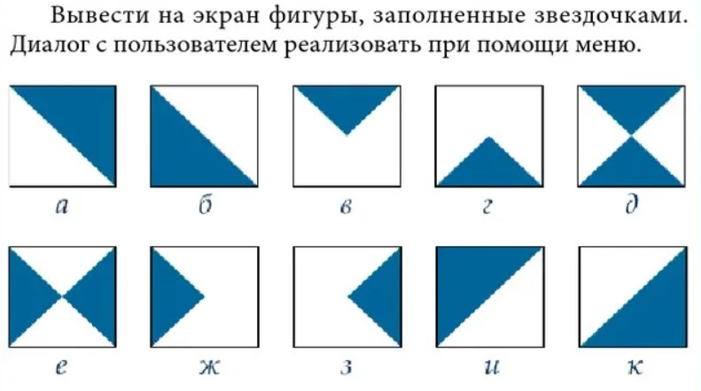

# **StarPrinter**

#### RU
Всем, привет! Я, думаю, на просторах интернета многие встречались с заданием от компьютерной академии STEP, где необходимо печатать фигуры, заполненные звёздочками.

#### EN
Hello, everyone! I believe many of you have encountered assignments from the STEP Computer Academy on the expanses of the internet, where it is necessary to print shapes filled with asterisks.



## Подсказки | Hints
Возьмём matrixSize = 10 | We take matrixSize = 10
```plaintext
 for (int i = 0; i < matrixSize; i++)
 {
    for (int j = 0; j < matrixSize; j++>)
    {
        if (УСЛОВИЕ)
            Console.Write('*');
        else
            Console.Write(' ');
    }
 }
```
УСЛОВИЕ | CONDITION:
##### j <= i
```plaintext
 1 // *
 2 // **
 3 // ***
 4 // ****
 5 // *****
 6 // ******
 7 // *******
 8 // ********
 9 // *********
10 // **********
```
##### j <= matrixSize - i - 1
```plaintext
 1 // **********
 2 // *********
 3 // ********
 4 // *******
 5 // ******
 6 // *****
 7 // ****
 8 // ***
 9 // **
10 // *
```
##### j >= matrixSize - i - 1
```plaintext
 1 //          *
 2 //         **
 3 //        ***
 4 //       ****
 5 //      *****
 6 //     ******
 7 //    *******
 8 //   ********
 9 //  *********
10 // **********
```
##### j >= i
```plaintext
 1 // **********
 2 //  *********
 3 //   ********
 4 //    *******
 5 //     ******
 6 //      *****
 7 //       ****
 8 //        ***
 9 //         **
10 //          *
```
## Результат | Result
#####а)
```plaintext
 1 // **********
 2 //  *********
 3 //   ********
 4 //    *******
 5 //     ******
 6 //      *****
 7 //       ****
 8 //        ***
 9 //         **
10 //          *
```
##### б)
```plaintext
 1 // *
 2 // **
 3 // ***
 4 // ****
 5 // *****
 6 // ******
 7 // *******
 8 // ********
 9 // *********
10 // **********
```
##### в)
```plaintext
 1 // **********
 2 //  ********
 3 //   ******
 4 //    ****
 5 //     **
 6 //
 7 //
 8 //
 9 //
10 //
```
##### г)
```plaintext
 1 //
 2 //
 3 //
 4 //
 5 //
 6 //     **
 7 //    ****
 8 //   ******
 9 //  ********
10 // **********
```
##### д)
```plaintext
 1 // **********
 2 //  ********
 3 //   ******
 4 //    ****
 5 //     **
 6 //     **
 7 //    ****
 8 //   ******
 9 //  ********
10 // **********
```
##### е)
```plaintext
 1 // *        *
 2 // **      **
 3 // ***    ***
 4 // ****  ****
 5 // **********
 6 // **********
 7 // ****  ****
 8 // ***    ***
 9 // **      **
10 // *        *
```
##### ж)
```plaintext
 1 // * 
 2 // **    
 3 // ***   
 4 // **** 
 5 // ******
 6 // ******
 7 // ****  
 8 // ***    
 9 // **     
10 // *      
```
##### з)
```plaintext
 1 //          *
 2 //         **
 3 //        ***
 4 //       ****
 5 //      *****
 6 //      *****
 7 //       ****
 8 //        ***
 9 //         **
10 //          *
```
##### и)
```plaintext
 1 // **********
 2 // *********
 3 // ********
 4 // *******
 5 // ******
 6 // *****
 7 // ****
 8 // ***
 9 // **
10 // *
```
##### к)
```plaintext
 1 //          *
 2 //         **
 3 //        ***
 4 //       ****
 5 //      *****
 6 //     ******
 7 //    *******
 8 //   ********
 9 //  *********
10 // **********
```